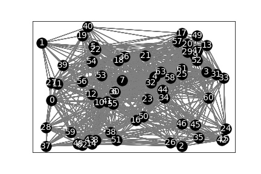
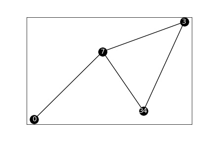
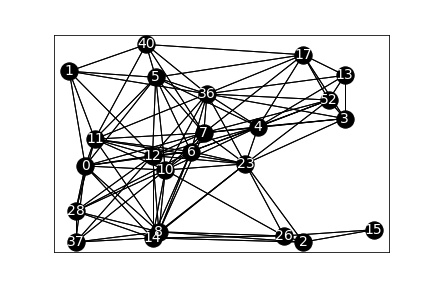

# Bluetooth LE Mesh Optimization Algorithms 


## The network when all devices set to "Relay" mode


Selected 64 relays out of 64 (100.0%), performance: 79.65%

## GreedyConnect


Selected 4 relays out of 64 (6.25%), performance: 35.5%

## Dominator


Selected 23 relays out of 64 (35.9375%), performance: 83.99%


## Try it out

```bash
pip install -r requirements.txt

cd test && jupyter notebook
```